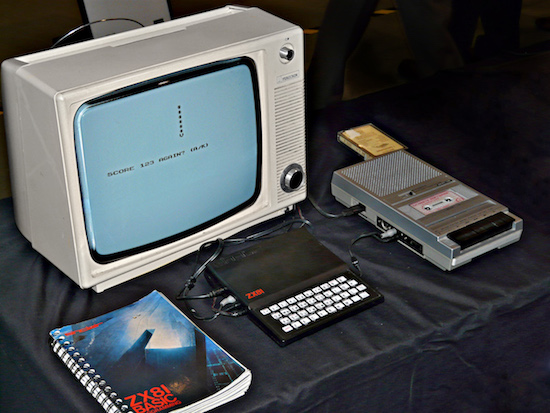

# Sinclair ZX81 Datasheet

* [Hardware](hardware.md)
* [Maintenance](maintenance.md)
* [Troubleshooting](troubleshooting.md)
* [Mods](mods.md)
* [List of Components](bom.md)

The ZX81 is the third computer from Sir Clive Sinclair's company, following the MK14 and the ZX80. Even having a relatively simple electronics, since it is made up of only 4 chips, it represents a significant improvement over its predecessor ZX80.

The computer is based on Zilog's Z80A microprocessor, with fairly limited RAM memory (1 kB), although expandable; and an 8 kB ROM that increased the 4 kb that the ZX80 had.

It introduces what would be a constant in Sinclair computers, which is the dedicated chip or "customized chip", such as the "Uncommitted Logic Array" or ULA.

The ULA was manufactured by Ferranti for Sinclair and replaces a total of 18 chips that performed similar functions in the ZX80. The main functions of this chip are:

* Generation of the clock frequency of 6.5 MHz through a ceramic filter.
* Bypass of the 3.5 MHz frequency necessary for microprocessor operation.
* TV signal generation compatible for RF modulator.
* Control of the external recording and playback device (SAVE / LOAD).
* Keyboard controls.
* Management of access priorities to RAM and ROM.
* Control of the general “timing” of the system.

Another important novelty compared to the ZX80 is the introduction of the SLOW mode, in addition to the FAST mode that it shares with the ZX80. This mode eliminates the annoying flicker characteristic of the ZX80 when making keystrokes.

The computer has no sound or color, working only in black and white and with limited graphic capabilities.

The keyboard is another of the characteristics of this computer, formed by a discussed membrane of 40 multifunction touch keys.

The computer uses Sinclair Basic as its programming language, whose interpreter is in ROM, in addition to the processor's own machine language. Although it is possible to find assemblers for other languages such as Forth.

It has an internal consumption in basic configuration of between 310 and 390 mA.

| Item  | Value |
| ------------- | ------------- |
|  Name |  Sinclair ZX81 |
|  Origin |  United Kingdom |
|  Launched |  March, 5th 1981 |
|  End of Production |  1984 |
|  Language |  Sinclair Basic |
|  Units Sold  |  > 1.5 Million |
|  Keyboard  |  40 Keys membrane keyboard |
|  CPU  |  Zilog Z80 A |
|  Speed  |  3.5 Mhz |
|  Bus  |  Data: 8 bits / Address 16 bits |
|  Ram  |  1KB (901 bytes available) - Max Expansion: 64KB (56 KB Available) |
|  Rom  |  8 KB |
|  Text Mode  | 32 x 24 (2 lines reserved for system messages and commands) |
|  Graphic Mode  | 64 x 44 (using PLOT / UNPLOT commands) |
|  Color  |  Black and White |
|  Sound  |  No |
|  Size and Weight  |  167 x 175 x 40 mm / 350 gr |
|  I/O Ports  |  Expansion Port, 2 cassete outputs (play and record), RF video output, load speed 300 bps (KCS) |
|  Power Source  |  External PSU, 9V DC, 600 mA (Positive polarity at the tip of the jack) |
|  Peripherals  |  ZX Printer |
|  Price  |  Kit: 50 GBP (UK, Jun 1981) - Assembled: 70 GBP (UK, Jun 1981) |
