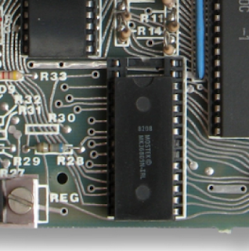

# ZX81 Troubleshooting

Leaving aside the signal tuning problems in modern TVs and the keyboard membrane, a list of the most common failures would be the following:

* Failures in the ULA other than the tuning of the TV signal. A clear symptom is the lack of image generation, or sometimes showing the screen in white with black lines forming some pattern, without showing the K cursor. In this type of pattern, also check the CPU.
* Connection faults in the contacts in the power connector, which is a Jack type (3.5 mm). The same jacks are used for the EAR and MIC connections, which can also be faulty. It is recommended to insert the power connector without the power supply being connected to the network.
* The ZX81 only works in FASTs mode. Check the circuit formed by TR1, C1, R1 and R17. Normally, TR1 is the element that has failed.
* Black screen and computer does not work, that is, it is not a fault related to the generation of the TV signal. Check that the 3.5MHz CLK signal is generated. Using an oscilloscope or logic probe, check the clock signal on pin 14 of the ULA. If the value is obtained, the generation is correct by the ULA. Then check the signal on pin 6 of the CPU. If it is not generated correctly, check the circuit formed by TR2, C7, R5 and R6. The normal thing is that transistor TR2 has failed. Another fault that causes a black screen is ROM or CPU failure, either because the ROM routines cannot be accessed or cannot be executed.
* Blank screen, without the K cursor appearing. It is a fault that can be attributed to the RAM or the ROM. The CPU executes the “START” routine of the ROM that the first thing it does is check the RAM (“RAM-CHECK” routine), and after this check the “INITIALISATION” routine is executed. This routine ends by displaying the cursor. Therefore, not showing the cursor is a symptom that some action has not been executed correctly for whatever reason. The most normal thing is that the “RAM-CHECK” routine has not obtained any expected value in the RAM check, keeping in mind that the “RAM-CHECK” routine is only executed if the ZX81 has 16kB.
* Integrated located in sockets. Many times, the problems are derived from bad connections, so a good cleaning and checking of the contacts may be enough. Sometimes the 24-pin ROM is plugged into a 28-pin socket. The correct connection is with the ROM aligned towards the bottom edge, i.e. the one closest to the heat sink.

On the ZX81 board there is only one voltage level, besides GND: +5V. Although these levels can be checked in the 7805 regulator, it is worth doing a quick check in the integrated ones. The following table shows the relationship of pins with the voltage levels in each of the integrated ones.

|  | CPUs | ULA | ROM | RAM 2114 | RAM 4118 | RAM 4816 |
|--|------|-----|-----|----------|----------|---------|
| GND | P29 | P34 | P12 | P9 | P12 | P14 |
| +5V | P11 | P40 | P24 | P18 | P24 | P28 |

